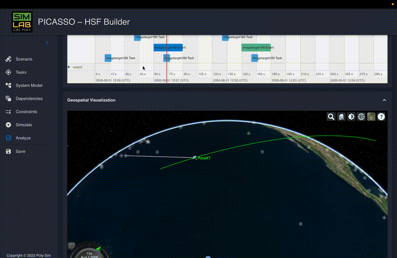
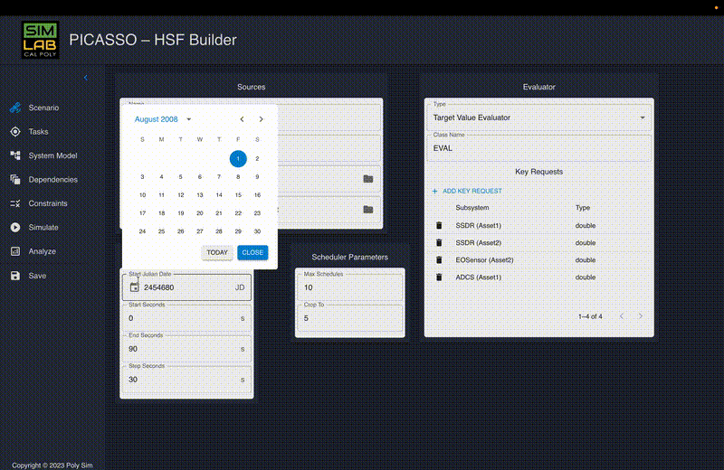

# PICASSO – Horizon Simulation Framework Builder

PICASSO is a desktop application for configuring, running, and inspecting simulations built on top of the **Horizon Simulation Framework (HSF)**. It provides a graphical interface for defining simulation inputs and exploring outputs, allowing researchers to reason about complex aerospace system behavior without working directly in configuration files or raw simulation outputs.

This project was developed in collaboration with the Aerospace Engineering Simulation Lab at Cal Poly, San Luis Obispo.
<p align="center">
  
  <br>
  <em><strong>Simulation Configuration:</strong> Defining system constraints and aerospace parameters.</em>
</p>

<p align="center">
  
  <br>
  <em><strong>Visual Analytics:</strong> Parsing and inspecting time-series state data for satellite tasks.</em>
</p>

<p align="center">
  <small><em>Note: GIFs optimized for performance and README load speed. High-resolution demos available upon request.</em></small>
</p>
---

## What PICASSO Does

PICASSO allows users to:

- Define and edit simulation parameters and inputs for Horizon simulations
- Launch simulations from a desktop interface
- Parse and visualize simulation outputs, including timelines, state changes, and system behavior over time
- Iterate on configurations as the underlying Horizon API evolves

---

## About the Horizon Simulation Framework

The **Horizon Simulation Framework (HSF)** is a modeling and simulation system developed at Cal Poly to simulate complex space-based systems. Given a system model, constraints, dependencies, and a set of tasks, Horizon produces time-series state data representing the “day in the life” (DITL) of the system.

These outputs are used for system-level analysis and requirements verification in aerospace research.

PICASSO provides a UI layer over this framework, translating structured simulation inputs and outputs into interfaces researchers can reason about.

---

## Architecture Overview

- Electron desktop application
- React frontend for configuration, visualization, and interaction
- Node.js backend to orchestrate simulation execution
- Interfaces with the Horizon simulation engine (.NET)
- Parses JSON-based inputs and outputs produced by Horizon

The application was built to accommodate changing simulation APIs and evolving output formats, which required flexible parsing and visualization logic.

---

## Running PICASSO (Development)

### Prerequisites

Check your installed versions:

```bash
node --version
dotnet --version
```

You will need:

- Node.js (latest LTS recommended)
- .NET SDK 8.0
  <https://dotnet.microsoft.com/en-us/download/dotnet/8.0>

---

### Setup

Pull the latest code:

```bash
git pull origin main
```

If you have previously run simulations with older versions of Horizon, the simulation output format may have changed. You may need to archive or delete existing output data:

```text
/Horizon/output
```

Install dependencies:

```bash
npm install
```

A post-install script ensures the correct Horizon submodule version is in place and rebuilds the simulation output directory.

---

### Start the App

```bash
npm run electron:serve
```

---

## Project Context and Notes

PICASSO was developed as a research-facing tool in an academic lab environment. Some aspects of the codebase (for example, build tooling and typing decisions) reflect the constraints and priorities of an evolving research project rather than a greenfield commercial product.

---

## Future Improvements

If continued development were planned, potential next steps would include:

- Completing a full TypeScript migration
- Modernizing the build pipeline (e.g., Vite-based setup)
- Improving test coverage around simulation input/output handling
- Adding richer visualization and comparison tools for simulation runs

---

## Author

Developed by **Keith Hall**
Software Engineer, Cal Poly Aerospace Simulation Lab
GitHub: <https://github.com/jkeithhall>
